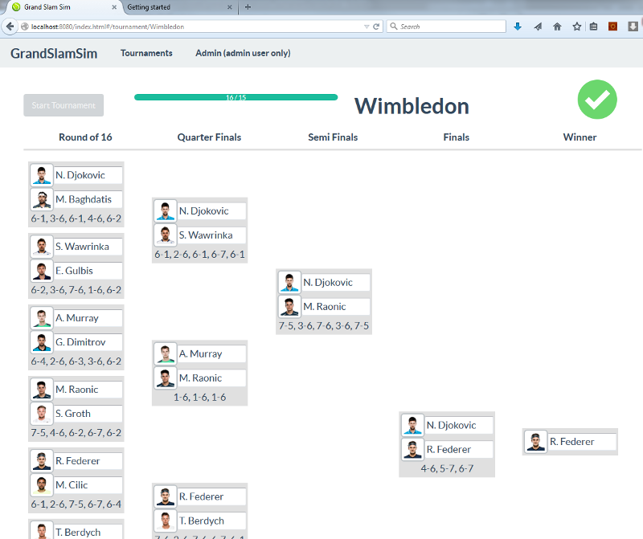

:source-highlighter: coderay
:data-uri:

`grand-slam-sim` is a demo application that was put together to demonstrate the use of websockets, database access and method level security in http://projects.spring.io/spring-boot/[Spring Boot]. The intention was to add and utilize these functionlities by writing a minimal amount of code, deferring all the heavy lifting to `Spring Boot`.

To make the demo application a bit more functional, a front end has been added using AngularJS and the concept of a tennis tournament simulator has been introduced to give the demo app a theme.

The application supports uploading of an Excel file containing players data in order to allow users to create their own tennis tournaments.

== Getting started

The library was built using the following toolchain:

* http://www.oracle.com/technetwork/java/javase/downloads/index.html[Java Oracle JDK 1.8]
* https://maven.apache.org/download.cgi[Maven 3.2.3]

Your mileage may vary with versions different than the ones specified above.

Follow these steps to get started:

1) Git-clone this repository.

----
$ git clone git://github.com/damianmcdonald/grand-slam-sim.git my-project
----

2) Change directory into your clone:

----
$ cd my-project
----
    
3) Use Maven to compile everything:

----
$ mvn compile
----

4) Start the application:

----
$ java -jar target/grandslamsim.jar
----

5) Connect to the app in a browser:

http://localhost:8080

== Screenshots

1) Login screen

2) Tournament select screen

3) Tournament screen

4) Admin screen

== Credits

As is often the case, clever people have provided solutions to many problems.

Much of the websockets and method level security code in this demo project was taken from or inspired by the https://github.com/salmar/spring-websocket-chat[spring-websocket-chat] application by https://github.com/salmar[salamr].

Help in trying to create an algorithm for _seeding_ tennis players in a tournament was found on http://stackoverflow.com/questions/22959408/algorithm-for-placement-of-32-seeded-players-in-a-128-person-tournament[stackoverflow].

